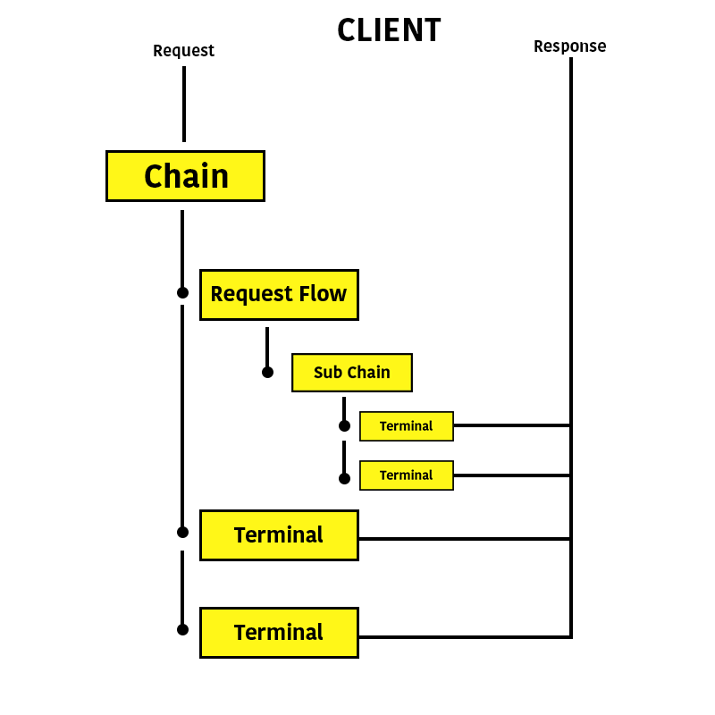
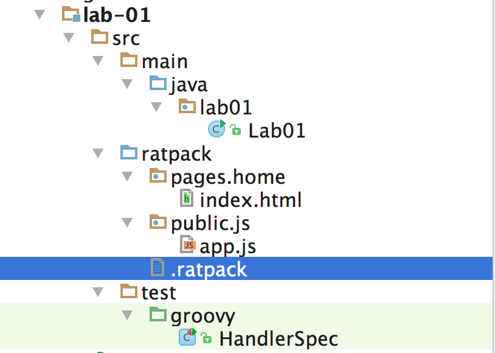

theme: Business Class

# Lab 01 - Handlers
- This lab will introduce you to fundamental application structure
- The handler chain is the fundamental pipeline for request processing in Ratpack

---

# Quick Primer on Handlers

- There are two types of handlers: _request flow_ and _terminal_
- _Request Flow_ handlers are responsible for directing the request to the proper point in the handler chain pipeline
- _Terminal_ handlers are an endpoint in the chain, responsible for processing a request and responding to a request

---

# Handler Chain Structure

- When a request is made, it is sent into the chain
- As the request passes through the chain, it tries to match a handler
- The first handler that matches the request gets to process it



---

# Handlers

- All handlers are bound by path and HTTP method
- Handlers can be defined as agnostic to HTTP method

---

# Terminal Handlers

- Methods on the chain for defining HTTP method handlers:
  - `get`, `post`, `put`, `delete`, `options`
- Methods on the chain for defining method-agnostic handlers:
  - `all`, `path`

---

# HTTP Get Handlers

- Optionally specify a string that represents the request path

```java
RatpackServer.start(spec -> spec
  .serverConfig(c -> c.baseDir(BaseDir.find()))
  .handlers(chain -> chain
    // THIS IS OUR HTTP GET HANDLER BOUND TO `/foo`
    .get("foo", ctx -> ctx.render("Hello Foo!"))
  )
)
```

---

# HTTP Get Handlers

- Optionally specify a string that represents the path

```java
RatpackServer.start(spec -> spec
  .serverConfig(c -> c.baseDir(BaseDir.find()))
  .handlers(chain -> chain
    // THIS IS OUR HTTP GET HANDLER BOUND TO `/`
    .get(ctx -> ctx.render("Hello Foo!"))
  )
)
```

- Note that this binding will not match requests to `/foo`

---

### Same rule applies for `post`, `put`, `delete`, `options` handlers on the chain...

---

# Method Agnostic Terminal Handlers

- Handlers for `all` and `path` will match any HTTP verb
- The `all` handler will never have a path specified, while the `path` handler will

```java
RatpackServer.start(spec -> spec
  .serverConfig(c -> c.baseDir(BaseDir.find()))
  .handlers(chain -> chain
    // Any and all requests, regardless of verb or path
    // will match this handler.
    .all(ctx -> ctx.render("Hello All!"))
  )
)
```

---

# Method Agnostic Terminal Handlers

- Handlers for `all` and `path` will match any HTTP verb
- The `all` handler will never have a path specified, while the `path` handler will

```java
RatpackServer.start(spec -> spec
  .serverConfig(c -> c.baseDir(BaseDir.find()))
  .handlers(chain -> chain
    // Any and all requests to `/foo` will match this handler
    .path("foo", ctx -> ctx.render("Hello Path!"))
  )
)
```

---

# Multiple HTTP Verb per Path

- Important: _only one handler can be bound to a given path_
- This means you cannot have `get("foo")` and `post("foo")` in the same chain
- To accommodate this behavior, we need to use the `byMethod` method on the `Context` object
- Important that you use `all` or `path` when building a handler for different verbs

---

# Multiple HTTP Verb per Path

- `ctx.byMethod(ByMethodSpec)` gives us the ability to attach processing for different HTTP verbs

```java
RatpackServer.start(spec -> spec
  .serverConfig(c -> c.baseDir(BaseDir.find()))
  .handlers(chain -> chain
    .path("foo", ctx -> 
      ctx.byMethod(byMethodSpec -> byMethodSpec
        .get(() -> ctx.render("Hello Foo GET!"))
        .post(() -> ctx.render("Hello Foo POST!"))
      )
    )    
  )
)
```

---

# Terminal Handlers: Sending a Response

- Two ways doing this:
  - You have already seen: `ctx.render(some object)`
  - You can also write a string directly to the response: `ctx.getResponse().send(string)`
- Generally, `ctx.render(...)` is preferred

---

# Terminal Handlers: Sending a Response

```java
RatpackServer.start(spec -> spec
  .serverConfig(c -> c.baseDir(BaseDir.find()))
  .handlers(chain -> chain
    .get(ctx -> ctx.getResponse().send("Hello World!"))
  )
)
```

---

# Dynamic Path Binding

- You will want the ability to create dynamic path bindings for resources
- This may allow you to build resource-oriented APIs or specify IDs as part of a path
- For this, we can use Ratpack's concept of "path tokens"

---

# Path Tokens

- Allows you to specify a dynamic variable in the path binding
- Can retrieve that path binding in your handler with `ctx.getAllPathTokens()`

```java
RatpackServer.start(spec -> spec
  .serverConfig(c -> c.baseDir(BaseDir.find()))
  .handlers(chain -> chain
    // The `:username` denotes a named path token
    // Request: GET /user/foo
    .get("user/:username", ctx -> {
      // We can get the named path token from `ctx.getAllPathTokens()`
      String username = ctx.getAllPathTokens().get("username");
      // Response: Hello user: foo
      ctx.getResponse().send("Hello user: " + username);
    })
  )
)
```

---

# Path Tokens

- A path token can be the entire path binding

```java
RatpackServer.start(spec -> spec
  .serverConfig(c -> c.baseDir(BaseDir.find()))
  .handlers(chain -> chain
    .get(":username", ctx -> {
      String username = ctx.getAllPathTokens().get("username");
      ctx.getResponse().send("Hello user: " + username);
    })
  )
)
```

---

# Path Tokens

- Path tokens can be specified as regular expression patterns
- Use the `::<pattern>` notation to create a regex path token

```java
RatpackServer.start(spec -> spec
  .serverConfig(c -> c.baseDir(BaseDir.find()))
  .handlers(chain -> chain
    // Will match any GET request starting with `ratpack-`
    .get("::ratpack-.*", ctx -> ctx.render("Hello Ratpack!"))
  )
)
```

---

# Path Binding

- As noted, the `Context` holds all the details that went into processing the request
- You can get access to the "path binding" for the current handler to introspect the requested path

---

# Path Binding

```java
RatpackServer.start(spec -> spec
  .serverConfig(c -> c.baseDir(BaseDir.find()))
  .handlers(chain -> chain
    .get("::ratpack-.*", ctx -> {
      // We use the `ctx.get(..)` method here to get access to the `PathBinding`
      // object that was created for this request
      PathBinding binding = ctx.get(PathBinding.class);

      // The `PathBinding` will allow us to get the path this path bound for this handler.
      // The `boundTo` variable here will be the full username from our regex binding.
      String boundTo = binding.getBoundTo();

      // Note that this will also include the request's `/`, so you may want to cleanse this.
      ctx.getResponse().send("Welcome " + boundTo);
    })
  )
)
```

---

# Accessing Request Data

- Any data from the request, including query parameters and headers, comes from the `Request` object
- The `Request` and `Response` types are available on the `Context` object

---

# Accessing Request Data

```java
RatpackServer.start(spec -> spec
  .serverConfig(c -> c.baseDir(BaseDir.find()))
  .handlers(chain -> chain
    .get(":username", ctx -> {
      // Get the username requested
      String username = ctx.getAllPathTokens().get("username");
      // Get the headers for the request
      Headers headers = ctx.getRequest().getHeaders();
      // Retrieve a custom header from the request
      String requestedBy = headers.get("X-Requested-By");
      ctx.getResponse().send("Request for " + username + " by " + requestedBy);
    })
  )
)
```

---

# Request Flow Handlers

- Are always HTTP method agnostic
- May be a simple handler that delegates the request down the chain
- Will almost always produce a "sub-chain"
- Important: once a request is in a sub-chain, it cannot escape back to the main chain

---

# Delegating down the chain

- Useful for introspecting a request or logging a message
- Very similar to terminal handlers, but instead we call `next()`

```java
final static Logger log = LoggerFactory.getLogger(Lab01.class);

RatpackServer.start(spec -> spec
  .serverConfig(c -> c.baseDir(BaseDir.find()))
  .handlers(chain -> chain
    // Processes message, then flows the request down the chain
    .all(ctx -> {
      // Log a message about the current request
      log.info("Incoming request!");
      // Delegate the request down the chain
      ctx.next();
    })
    .get("foo", ctx -> ctx.render("Hello Foo!"))
  )
)
```

---

# Prefixed routes

- The `prefix` request flow handler allows you to build a chain for a specific path

```java
RatpackServer.start(spec -> spec
  .serverConfig(c -> c.baseDir(BaseDir.find()))
  .handlers(chain -> chain
    // Creates a sub-chain for `/foo`
    .prefix("foo", fooChain -> fooChain
      // Logs a message for all incoming requests to this chain
      .all(ctx -> {
        log.info("Incoming Foo Request!");
        ctx.next();
      })
      // Responds to GET requests for `/foo`
      .get(ctx -> ctx.render("Hello Foo!"))
    )
  )
)
```

---

# Conditional Chains

- The `when` handler lets to test the incoming request and delegate the request to a sub-chain

```java
RatpackServer.start(spec -> spec
  .serverConfig(c -> c.baseDir(BaseDir.find()))
  .handlers(chain -> chain
    .when(ctx -> {
      // This is our test. If we return true from here, the request
      // will be delegated down the `adminChain`
      Headers headers = ctx.getRequest().getHeaders();
      return "admin".equals(headers.get("X-Requested-By"))
    }, { adminChain -> adminChain
      .get("users", ctx -> ...)
      .get("some-other-admin-function", ctx -> ...)
      .get(ctx -> ctx.render("Welcome Admin User"))
    })

    // If the `when` handler didn't route down the admin chain, we come here
    .get(ctx -> ctx.render("Welcome Regular User"))
  )
)
```

---

# Serving Static Assets

- Ratpack has the concept of a virtual "base directory"
- This is somewhere within your project structure that contains static assets for your site
- This may include your HTML, JavaScript, CSS
- May also include any templates you want to be dynamically rendered back to the client

---

# Serving Static Assets

- The base directory can be discovered by placing a marker `.ratpack` file within the source root
- Good practice is to have a `src/ratpack` directory where the marker file and your static assets live
- Use `BaseDir.find()` to discover where the base directory lives in your project



---

# Serving Static Assets

- For serving static assets, use the special `files` handler type
- Configure the directory for where the static assets will come to using the `FileHandlerSpec`
- Directories are resolved relative to the base directory

```java
RatpackServer.start(spec -> spec
  .serverConfig(c -> c.baseDir(BaseDir.find()))
  .handlers(chain -> chain
    .files(fileHandlerSpec -> fileHandlerSpec.dir("pages").indexFiles("index.html"))
  )
)
```

---

# Test Structure

- Spock is the preferred testing framework, though there's no hard and fast requirement on it
- The `MainClassApplicationUnderTest` allows Ratpack's test infrastructure to bootstrap our application for functional testing
- We can have our tests make requests against a running version of our application by using the provided `TestHttpClient`

---

### Now, open the `lab-01/src/test/groovy/HandlerSpec.groovy` file.